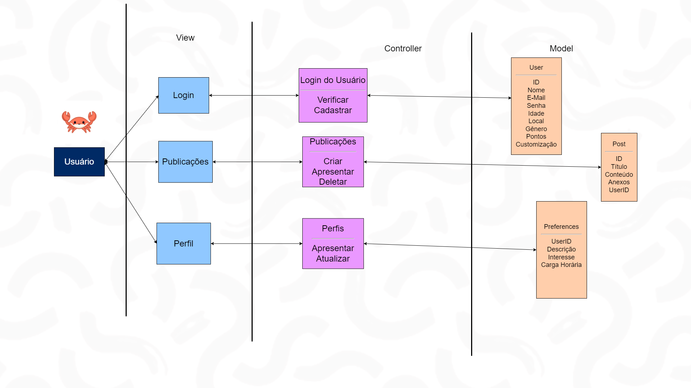

# Atividade ponderada - Arquitetura do MVC em Sails

Figura 1 - Arquitetura em MVP da plataforma
 

Fonte: Material produzido pelo grupo Tripulação Voluntária (2024)

## Sobre o projeto
• Nome do Projeto: Oportuniza - Plataforma de um mar de oportunidades do voluntariado
• Descrição: A plataforma Oportuniza busca conectar voluntários de todo o Brasil em uma rede de oportunidades ligadas aos serviços sociais e também fazer com que eles possam conhecer mais voluntários, formando assim uma rede de apoio.
• Arquitetura: MVC (Model-View-Controller)
• Ferramenta de Diagramação: draw.io

## Modelos (Models):
• Descreva as entidades do seu projeto e seus atributos.
• Explique as relações entre as entidades.
Controladores (Controllers):
• Liste os controladores do seu projeto e suas responsabilidades,

## Controladores (Controllers):
• Login do Usuário, tendo como responsabilidades "Verificar" (para verificar se aquele sistema de login já existe, e se sim, logar na conta) e "Cadastrar" (para usuários que não estão cadastrados ainda) um usuário específico na nossa plataforma. Esse controlador é ligado a View "Login", e para interagir com o Model chamado "User" irá criar um ID específico para aquele usuário e precisará receber como atributo nome, e-mail, senha, idade, local, gênero, e irá gerar uma pontuação e um ponto de customização para aquele usuário, já que a nossa plataforma terá uma dinâmica de personalizar um carangueijo.

• Publicações, tendo como responsabilidades "Criar" (para publicar algo), "Apresentar" (para exibir a publicação inteira) e "Deletar" (para excluir uma publicação específica). Esse controlador é ligado a View "Publicações", e para interagir com o model "Post" será criado um ID da publicação, e ela irá conter Título, o corpo do texto, também intitulado de "Conteúdo", Anexos, caso seja necessário para o usuário, e o próprio UserID para o sistema identificar a quem aquela publicação está ligada.

• Perfil, tendo como responsabilidades "Apresentar" (para exibir o perfil) e "Atualizar" (para atualizar algum ponto específico daquele perfil de usuário). Esse controlador é ligado a View "Perfil", e para interagir com o model "preferences" será enviado o UserID, uma descrição que está presente no perfil daquele usuário, os seus pontos de interesses para prestação de um trabalho voluntário e a sua carga horária total.

## Views (Views):
• Login: responsável pelo sistema de Login ou cadastro de um usuário
• Publicações: Responsável pelas postagens dos usuários que estarão presentes ao longo da plataforma
• Perfil: Responsável pela apresentação do perfil do usuário e as suas informações

## Infraestrutura:
• O Banco de dados utilizado é o PostgreSQL, so tipo SQL, e ele irá interagir com o projeto ao armazenar as diversas variáveis que estão presentes em Model, como informações a respeito dos usuários e informações a respeito de publicações.

## Implicações da Arquitetura:
Essa arquitetura faz com que o projeto do grupo tenha um índice de escalabiliade no sentido de que é fácil expandir para novos horizontes e novos projetos ao não armazenarmos dados que sejam específicos e que não são utilizados por outras plataformas. Para manutenção, podemos testar e analisar quais são as variáveis que estão apresentando algum problema de armazenamento e até se notarmos que ela não possui uma relevância significativa no projeto, a excluir pode ser algo viável a ser discutido entre o grupo. A Testagem fica por conta de verificar se realmente todas as variáveis presentes estarão desempenhando um papel útil de armazenamento. Com isso, concluimos que a arquitetura do sistema Oportuniza, do grupo Tripulação Voluntária é eficiente e tem uma enorme perspectiva de expansão.

## Aluno: Pablo de Azevedo - T11
